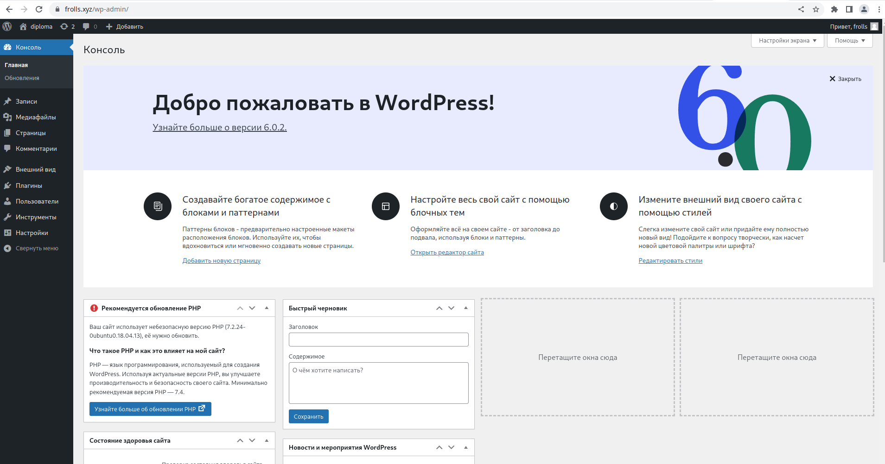
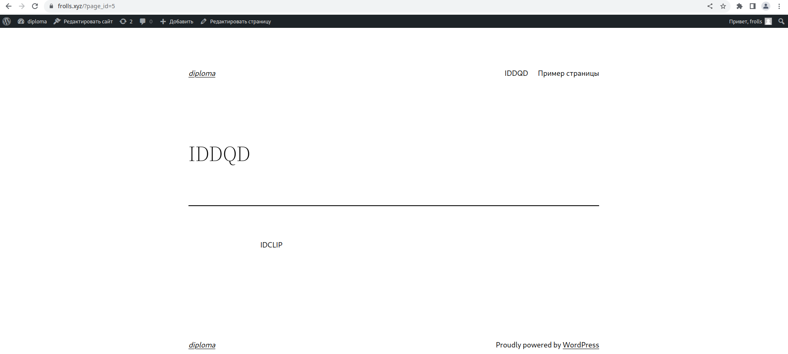
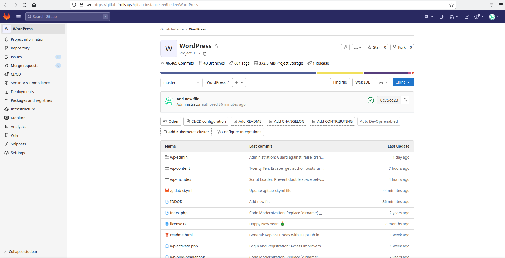
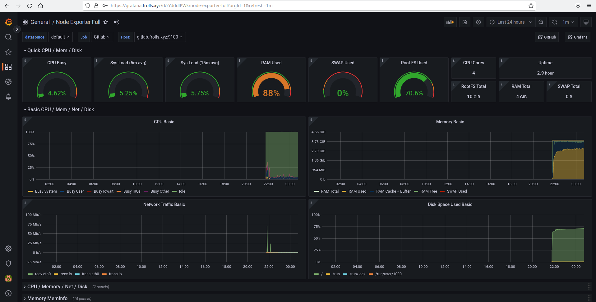
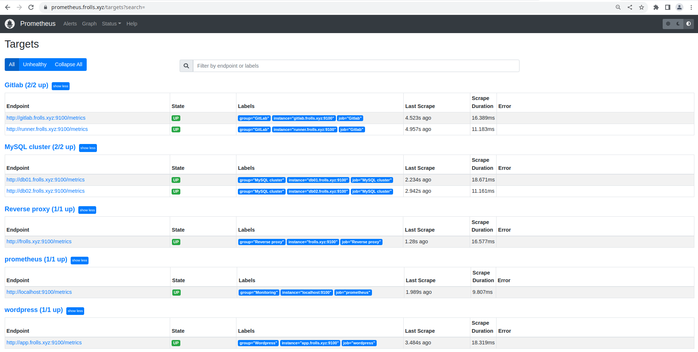
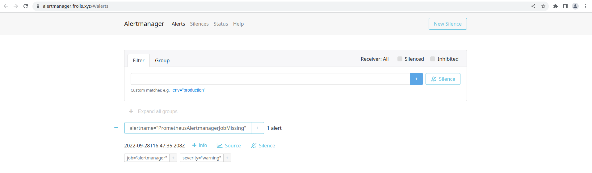

# Дипломный практикум в YandexCloud

- [Цели:](#цели)
- [Этапы выполнения:](#этапы-выполнения)
  - [Регистрация доменного имени](#регистрация-доменного-имени)
  - [Создание инфраструктуры](#создание-инфраструктуры)
    - [Установка Nginx и LetsEncrypt](#установка-nginx)
    - [Установка кластера MySQL](#установка-mysql)
    - [Установка WordPress](#установка-wordpress)
    - [Установка Gitlab CE, Gitlab Runner и настройка CI/CD](#установка-gitlab)
    - [Установка Prometheus, Alert Manager, Node Exporter и Grafana](#установка-prometheus)
- [Что необходимо для сдачи задания?](#что-необходимо-для-сдачи-задания)
- [Как правильно задавать вопросы дипломному руководителю?](#как-правильно-задавать-вопросы-дипломному-руководителю)

---

## Цели:

1. Зарегистрировать доменное имя (любое на ваш выбор в любой доменной зоне).
2. Подготовить инфраструктуру с помощью Terraform на базе облачного провайдера YandexCloud.
3. Настроить внешний Reverse Proxy на основе Nginx и LetsEncrypt.
4. Настроить кластер MySQL.
5. Установить WordPress.
6. Развернуть Gitlab CE и Gitlab Runner.
7. Настроить CI/CD для автоматического развёртывания приложения.
8. Настроить мониторинг инфраструктуры с помощью стека: Prometheus, Alert Manager и Grafana.

---

## Этапы выполнения:

### Регистрация доменного имени

Зарегистрировал доменное имя `frolls` в доменной зоне `xyz`.

[Вот результаты](milestones/get_domain_name/README.md)

---

### Создание инфраструктуры

[Описание и результаты](milestones/create_infrastructure/README.md)

---

### Установка Nginx и LetsEncrypt

[Вот что получилось](milestones/reverse_proxy/README.md)

---

### Установка кластера MySQL

[Ссылка на роль, а так же результаты](milestones/mysql_cluster/README.md)

---

### Установка WordPress

Результаты [тут](milestones/wordpress/README.md)

---

### Установка Gitlab CE и Gitlab Runner

Все наработки находятся [здесь](milestones/gitlab/README.md)

---

### Установка Prometheus, Alert Manager, Node Exporter и Grafana

Результаты работы можно посмотреть [здесь](milestones/monitoring/README.md)

---

## Что необходимо для сдачи задания?

1. Репозиторий со всеми Terraform манифестами и готовность продемонстрировать создание всех ресурсов с нуля.
2. Репозиторий со всеми Ansible ролями и готовность продемонстрировать установку всех сервисов с нуля.
3. Скриншоты веб-интерфейсов всех сервисов работающих по HTTPS на вашем доменном имени.

- `https://www.you.domain` (WordPress)
- `https://gitlab.you.domain` (Gitlab)
- `https://grafana.you.domain` (Grafana)
- `https://prometheus.you.domain` (Prometheus)
- `https://alertmanager.you.domain` (Alert Manager)

4. Все репозитории рекомендуется хранить на одном из ресурсов ([github.com](https://github.com) или [gitlab.com](https://gitlab.com)).

## Решение

1. Репозиторий со всеми Terraform манифестами и готовность продемонстрировать создание всех ресурсов с нуля.

Terrafotm-манифесты:

- [модуль инстансов](https://github.com/Frolls/tf-modules/tree/main/vm-instance)
- [конфигурация для создания инфраструкруры в yc](https://github.com/Frolls/tf-yc-infrastructure)

2. Репозиторий со всеми Ansible ролями и готовность продемонстрировать установку всех сервисов с нуля.

Ansible-роли

- [Установка Nginx и LetsEncrypt](https://github.com/Frolls/reverse-proxy-role)
- [Установка кластера MySQL](https://github.com/Frolls/mysql-cluster-role)
- [Установка WordPress](https://github.com/Frolls/wordpress-role)
- [Установка Gitlab CE](https://github.com/Frolls/ansible-role-gitlab)
- [Установка Gitlab Runner](https://github.com/Frolls/gitlab-runner-role)
- [Node Exporter](https://github.com/Frolls/node-exporter-role)
- [Установка Prometheus, Alert Manager, Grafana](https://github.com/Frolls/monitoring-role)

3. Скриншоты веб-интерфейсов всех сервисов работающих по HTTPS на вашем доменном имени.

- `https://www.frolls.xyz`:

- `https://gitlab.frolls.xyz`:

- `https://grafana.frolls.xyz`

- `https://prometheus.frolls.xyz`

- `https://alertmanager.frolls.xyz`

