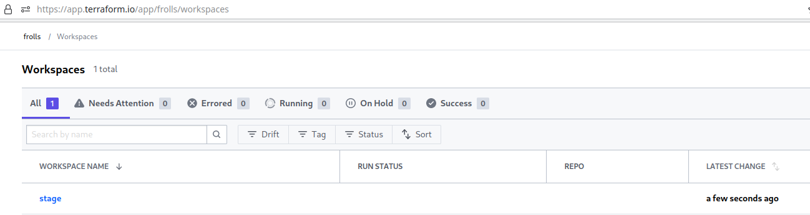
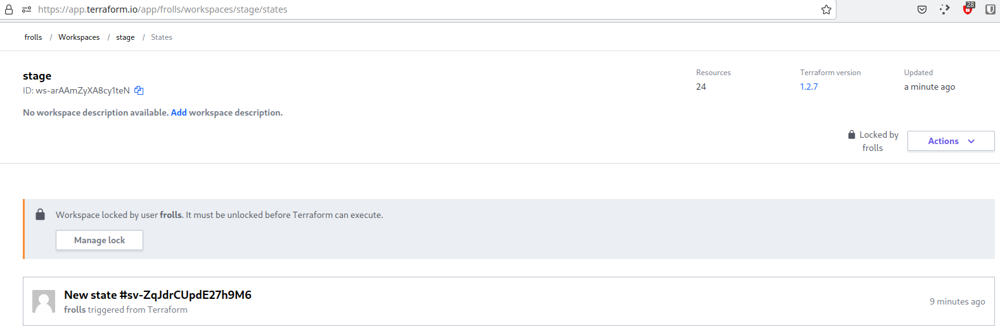
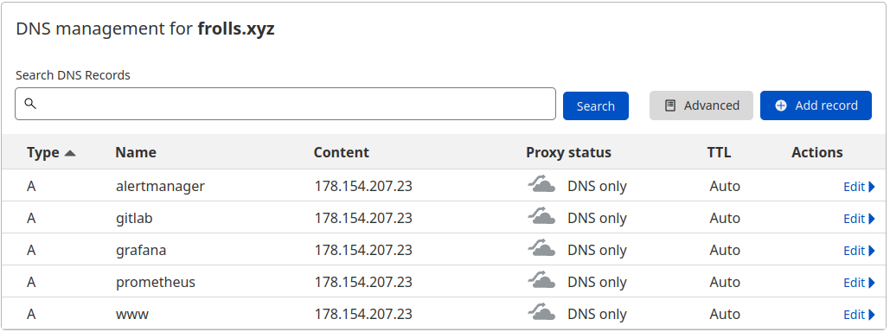
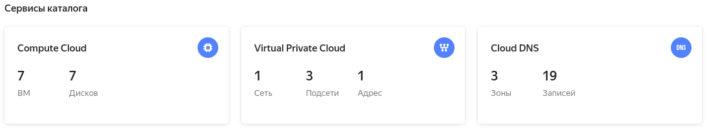
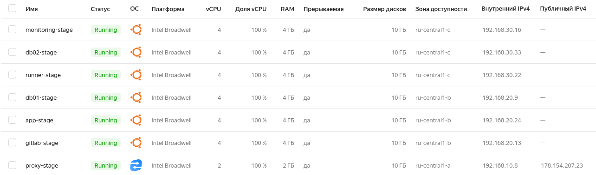

## Создание инфраструктуры

Для начала необходимо подготовить инфраструктуру в YC при помощи [Terraform](https://www.terraform.io/).

Особенности выполнения:

- Бюджет купона ограничен, что следует иметь в виду при проектировании инфраструктуры и использовании ресурсов;
- Следует использовать последнюю стабильную версию [Terraform](https://www.terraform.io/).

Предварительная подготовка:

1. Создайте сервисный аккаунт, который будет в дальнейшем использоваться Terraform для работы с инфраструктурой с необходимыми и достаточными правами. Не стоит использовать права суперпользователя
2. Подготовьте [backend](https://www.terraform.io/docs/language/settings/backends/index.html) для Terraform:
   а. Рекомендуемый вариант: [Terraform Cloud](https://app.terraform.io/)  
   б. Альтернативный вариант: S3 bucket в созданном YC аккаунте.
3. Настройте [workspaces](https://www.terraform.io/docs/language/state/workspaces.html)
   а. Рекомендуемый вариант: создайте два workspace: *stage* и *prod*. В случае выбора этого варианта все последующие шаги должны учитывать факт существования нескольких workspace.  
   б. Альтернативный вариант: используйте один workspace, назвав его *stage*. Пожалуйста, не используйте workspace, создаваемый Terraform-ом по-умолчанию (*default*).
4. Создайте VPC с подсетями в разных зонах доступности.
5. Убедитесь, что теперь вы можете выполнить команды `terraform destroy` и `terraform apply` без дополнительных ручных действий.
6. В случае использования [Terraform Cloud](https://app.terraform.io/) в качестве [backend](https://www.terraform.io/docs/language/settings/backends/index.html) убедитесь, что применение изменений успешно проходит, используя web-интерфейс Terraform cloud.

Цель:

1. Повсеместно применять IaaC подход при организации (эксплуатации) инфраструктуры.
2. Иметь возможность быстро создавать (а также удалять) виртуальные машины и сети. С целью экономии денег на вашем аккаунте в YandexCloud.

Ожидаемые результаты:

1. Terraform сконфигурирован и создание инфраструктуры посредством Terraform возможно без дополнительных ручных действий.
2. Полученная конфигурация инфраструктуры является предварительной, поэтому в ходе дальнейшего выполнения задания возможны изменения.

## Результаты

1. Создал сервисный аккаунт для каталога:

```bash
[frolls@mainframe terraform]$ yc resource-manager folders list-access-bindings netology
+---------+----------------+----------------------+
| ROLE ID |  SUBJECT TYPE  |      SUBJECT ID      |
+---------+----------------+----------------------+
| editor  | serviceAccount | aje99d2htpntnjb1rbt2 |
+---------+----------------+----------------------+
```

2. Подготовил backend для Terraform. Использовал рекомендуемый вариант Terraform Cloud:



Прикрутил VCS (правда, потом открутил, иначе не давал выполнять в консоли `terraform apply`)

3. Создал workspace `stage` и `prod`. Все дальнейшие действия будем производить в окружении `stage`.


4. Создайте VPC с подсетями в разных зонах доступности.

Получилось как-то так:

```bash
[frolls@mainframe ~]$ yc vpc subnet list
+----------------------+----------+----------------------+----------------------+---------------+-------------------+
|          ID          |   NAME   |      NETWORK ID      |    ROUTE TABLE ID    |     ZONE      |       RANGE       |
+----------------------+----------+----------------------+----------------------+---------------+-------------------+
| b0ceaat7bsj7enioullc | subnet-3 | enp04k112si51v58g44p | enpn3atg99i8ptnjqcuh | ru-central1-c | [192.168.30.0/24] |
| e2l71v3nsg68k9soagec | subnet-2 | enp04k112si51v58g44p | enpn3atg99i8ptnjqcuh | ru-central1-b | [192.168.20.0/24] |
| e9b2c1mumlt5i5frktui | subnet-1 | enp04k112si51v58g44p |                      | ru-central1-a | [192.168.10.0/24] |
+----------------------+----------+----------------------+----------------------+---------------+-------------------+
```

5. Убедитесь, что теперь вы можете выполнить команды `terraform destroy` и `terraform apply` без дополнительных ручных действий.

Убедился )

6. В случае использования [Terraform Cloud](https://app.terraform.io/) в качестве [backend](https://www.terraform.io/docs/language/settings/backends/index.html) убедитесь, что применение изменений успешно проходит, используя web-интерфейс Terraform cloud.

Скриншот, на котором видно, что всё у нас пока что хорошо:



---

## Небольшое описание, чем закончились попытки создать инфраструктуру

Для удобства работы с интансами создал модуль [`vm-instance`](https://github.com/Frolls/tf-modules/tree/main/vm-instance)

В итоге получилась конфигурация, которая:

- создает VPC с подсетями в разных зонах доступности; 
- разворачивает инстансы (получилось семь) в этих подсетях;
- настраивает A-записи. Запускается отдельная конфигурация для провайдера cloudflare;
- создает inventory-файл для ansible;
- создает дополнительные файлы для ansible-ролей.

Вот что получилось по итогу:

DNS записи:



В yc:



