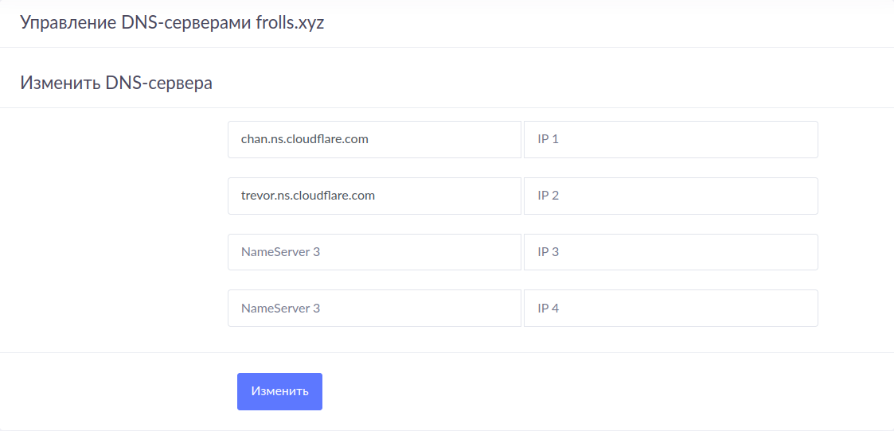
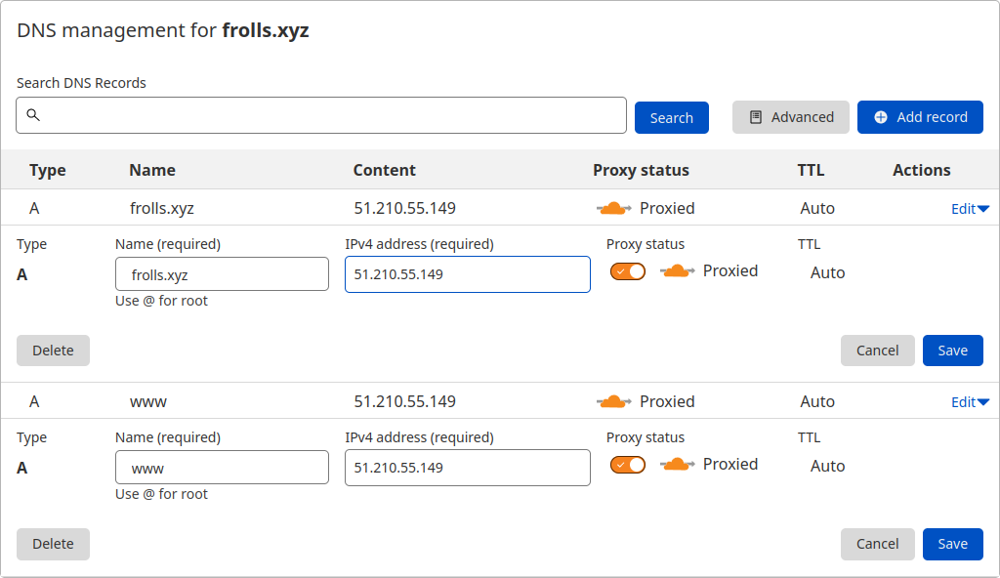

## Регистрация доменного имени

Подойдет любое доменное имя на ваш выбор в любой доменной зоне.

ПРИМЕЧАНИЕ: Далее в качестве примера используется домен `you.domain` замените его вашим доменом.

Рекомендуемые регистраторы:

- [nic.ru](https://nic.ru)
- [reg.ru](https://reg.ru)

Цель:

1. Получить возможность выписывать [TLS сертификаты](https://letsencrypt.org) для веб-сервера.

Ожидаемые результаты:

1. У вас есть доступ к личному кабинету на сайте регистратора.
2. Вы зарезистрировали домен и можете им управлять (редактировать dns записи в рамках этого домена).

## Результаты

Возможно, я связался не с тем регистратором..

Доступ к личному кабинету на сайте регистратора:



Вывод dig:

```bash
[frolls@mainframe diplom-devops]$ dig A +noall +answer frolls.xyz
frolls.xyz.             192     IN      A       172.67.147.235
frolls.xyz.             192     IN      A       104.21.28.245
```

Ниже пример того, как можно редактировать DNS-записи в рамках нового домена:

