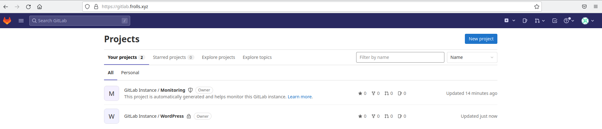
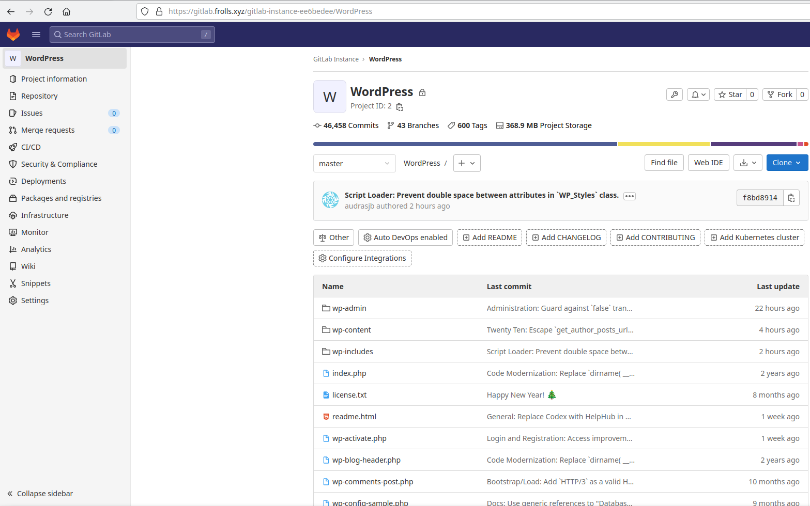
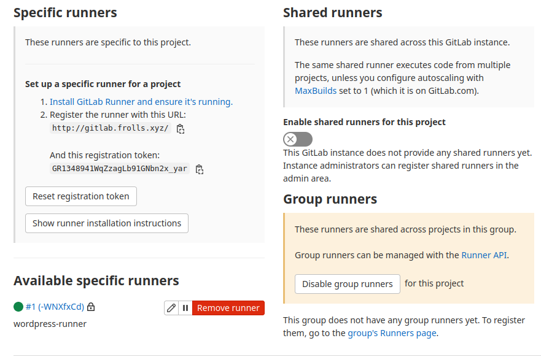
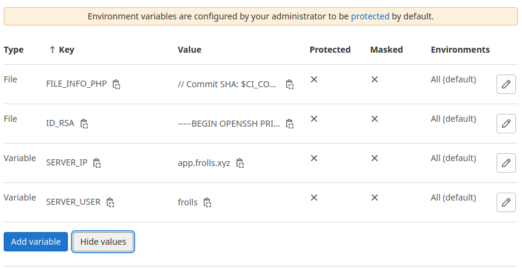
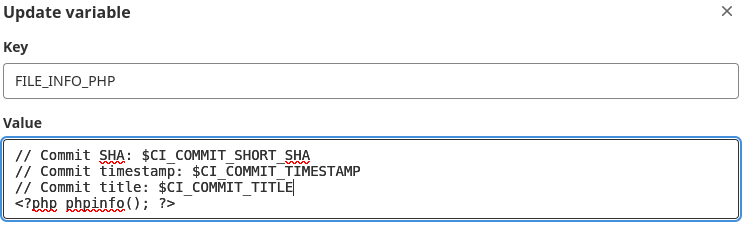
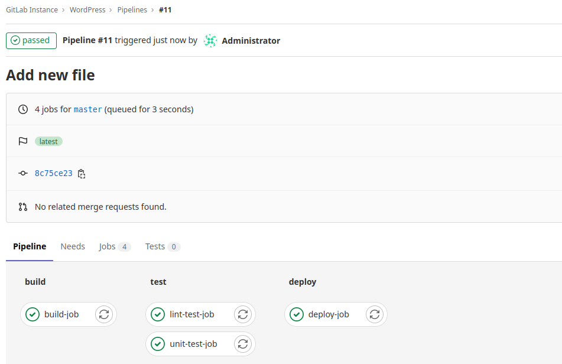
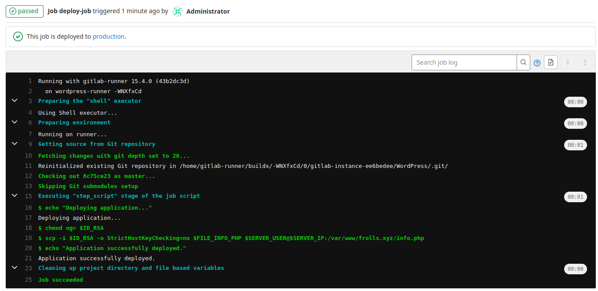
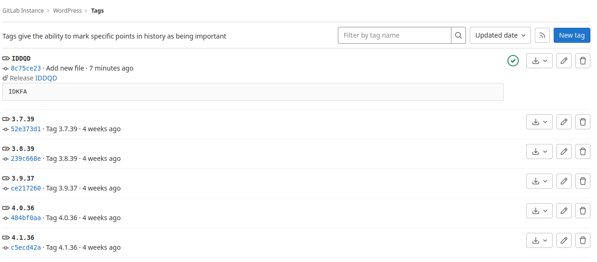

## Установка Gitlab CE и Gitlab Runner

Необходимо настроить CI/CD систему для автоматического развертывания приложения при изменении кода.

Рекомендации:
  - Имена серверов: `gitlab.you.domain` и `runner.you.domain`
  - Характеристики: 4vCPU, 4 RAM, Internal address.

Цель:
1. Построить pipeline доставки кода в среду эксплуатации, то есть настроить автоматический деплой на сервер `app.you.domain` при коммите в репозиторий с WordPress.

Подробнее об [Gitlab CI](https://about.gitlab.com/stages-devops-lifecycle/continuous-integration/)

Ожидаемый результат:

1. Интерфейс Gitlab доступен по https.
2. В вашей доменной зоне настроена A-запись на внешний адрес reverse proxy:
    - `https://gitlab.you.domain` (Gitlab)
3. На сервере `you.domain` отредактирован upstream для выше указанного URL и он смотрит на виртуальную машину на которой установлен Gitlab.
4. При любом коммите в репозиторий с WordPress и создании тега (например, v1.0.0) происходит деплой на виртуальную машину.

# Решение


Ansible-роли можно утащить:

- GitLab: [тут](https://github.com/Frolls/ansible-role-gitlab);
- GitLab Runner: [здесь](https://github.com/Frolls/gitlab-runner-role)

Не заморачивался в пользователями и их правами.

1. Интерфейс Gitlab доступен по https

Таки да:



2. Впечатление, что она была с начала времен
3. Да, роль `reverse-proxy-role` сделала это
4. При любом коммите в репозиторий с WordPress и создании тега (например, v1.0.0) происходит деплой на виртуальную машину

Хмм.. Сначала нужно клонировать репозиторий..

Склонировал:



Далее подключаем Runner и пытаемся его использовать. Не вдаваясь в очевидные подрбности, подключаем:



Для продолжения вакханалии придется создать переменные для доступа, а так же upload.

Создание перменнных:





Сам pipeline:

```yml
# This file is a template, and might need editing before it works on your project.
# This is a sample GitLab CI/CD configuration file that should run without any modifications.
# It demonstrates a basic 3 stage CI/CD pipeline. Instead of real tests or scripts,
# it uses echo commands to simulate the pipeline execution.
#
# A pipeline is composed of independent jobs that run scripts, grouped into stages.
# Stages run in sequential order, but jobs within stages run in parallel.
#
# For more information, see: https://docs.gitlab.com/ee/ci/yaml/index.html#stages
#
# You can copy and paste this template into a new `.gitlab-ci.yml` file.
# You should not add this template to an existing `.gitlab-ci.yml` file by using the `include:` keyword.
#
# To contribute improvements to CI/CD templates, please follow the Development guide at:
# https://docs.gitlab.com/ee/development/cicd/templates.html
# This specific template is located at:
# https://gitlab.com/gitlab-org/gitlab/-/blob/master/lib/gitlab/ci/templates/Getting-Started.gitlab-ci.yml

stages:          # List of stages for jobs, and their order of execution
  - build
  - test
  - deploy

build-job:       # This job runs in the build stage, which runs first.
  stage: build
  script:
    - echo "Compiling the code..."
    - echo "Compile complete."

unit-test-job:   # This job runs in the test stage.
  stage: test    # It only starts when the job in the build stage completes successfully.
  script:
    - echo "Running unit tests... This will take about 60 seconds."
    - sleep 1
    - echo "Code coverage is 90%"

lint-test-job:   # This job also runs in the test stage.
  stage: test    # It can run at the same time as unit-test-job (in parallel).
  script:
    - echo "Linting code... This will take about 10 seconds."
    - sleep 1
    - echo "No lint issues found."

deploy-job:      # This job runs in the deploy stage.
  stage: deploy  # It only runs when *both* jobs in the test stage complete successfully.
  environment: production
  script:
    - echo "Deploying application..."
    - chmod og= $ID_RSA
    - scp -i $ID_RSA -o StrictHostKeyChecking=no $FILE_INFO_PHP $SERVER_USER@$SERVER_IP:/var/www/frolls.xyz/info.php
    - echo "Application successfully deployed."
```

Проверим, что все работает? Конечно!

Не будем заморачиваться с клонированием, кючами и прочим штучками, а сделаем все из WEB-интерфейса.

Итак, проверка деплоя при коммите:





На сервере `app.frols.xyz` появился файл `info.php`:

```bash
frolls@app:/var/www/frolls.xyz$ ls -lah
total 244K
drwxr-xr-x  5 frolls   frolls   4.0K Sep 28 18:57 .
drwxr-xr-x  4 root     root     4.0K Sep 28 16:40 ..
-rw-r--r--  1 www-data www-data  15K Sep 28 16:41 db-config.php
-rw-r--r--  1 www-data www-data  405 Feb  6  2020 index.php
-rw-rw-r--  1 frolls   frolls    120 Sep 28 19:05 info.php
-rw-r--r--  1 www-data www-data  20K Jan  1  2022 license.txt
-rw-r--r--  1 www-data www-data 7.3K Mar 22  2022 readme.html
-rw-r--r--  1 www-data www-data 7.0K Jan 21  2021 wp-activate.php
drwxr-xr-x  9 www-data frolls   4.0K Aug 30 17:40 wp-admin
-rw-r--r--  1 www-data www-data  351 Feb  6  2020 wp-blog-header.php
-rw-r--r--  1 www-data www-data 2.3K Nov  9  2021 wp-comments-post.php
-rw-r--r--  1 www-data www-data 3.1K Sep 28 16:41 wp-config.php
-rw-r--r--  1 www-data www-data 3.0K Dec 14  2021 wp-config-sample.php
drwxr-xr-x  4 www-data www-data 4.0K Sep 28 18:35 wp-content
-rw-r--r--  1 www-data www-data 3.9K Apr 28 09:49 wp-cron.php
drwxr-xr-x 26 www-data www-data  12K Aug 30 17:40 wp-includes
-rw-r--r--  1 www-data www-data 2.5K Mar 19  2022 wp-links-opml.php
-rw-r--r--  1 www-data www-data 3.9K Apr 12 01:47 wp-load.php
-rw-r--r--  1 www-data www-data  48K Apr 29 14:36 wp-login.php
-rw-r--r--  1 www-data www-data 8.4K Mar 22  2022 wp-mail.php
-rw-r--r--  1 www-data www-data  24K Apr 12 09:26 wp-settings.php
-rw-r--r--  1 www-data www-data  32K Apr 11 11:42 wp-signup.php
-rw-r--r--  1 www-data www-data 4.7K Apr 11 11:42 wp-trackback.php
-rw-r--r--  1 www-data www-data 3.2K Jun  8  2020 xmlrpc.php
```
Содержимое этого файла:

```
// Commit SHA: 8c75ce23
// Commit timestamp: 2022-09-28T19:05:13+00:00
// Commit title: Add new file
<?php phpinfo(); ?>
```

Создадим новый тэг `IDDQD` и посмотрим, что получится..

Ой, оказывается все получилось:


