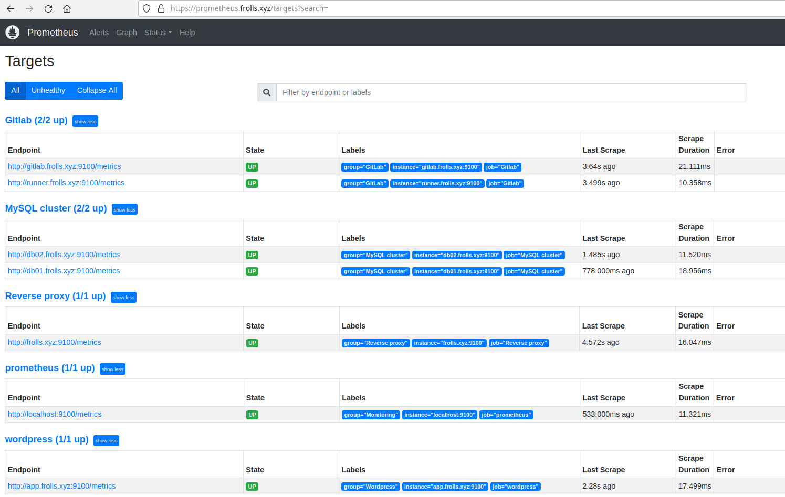
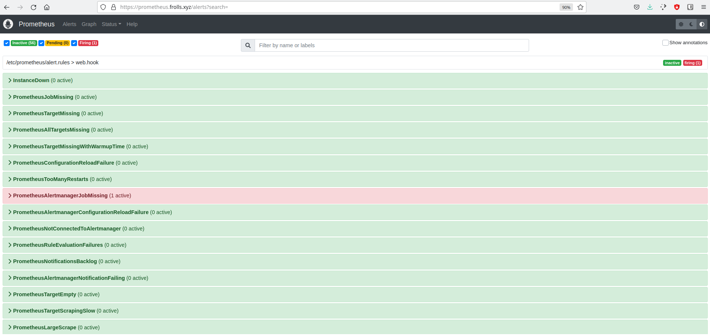
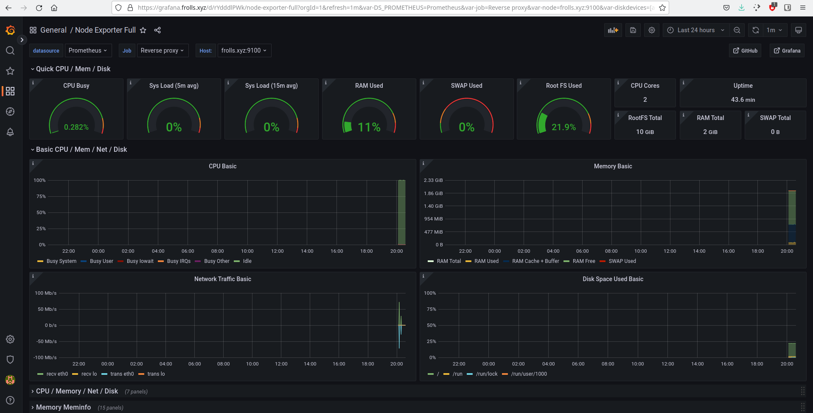
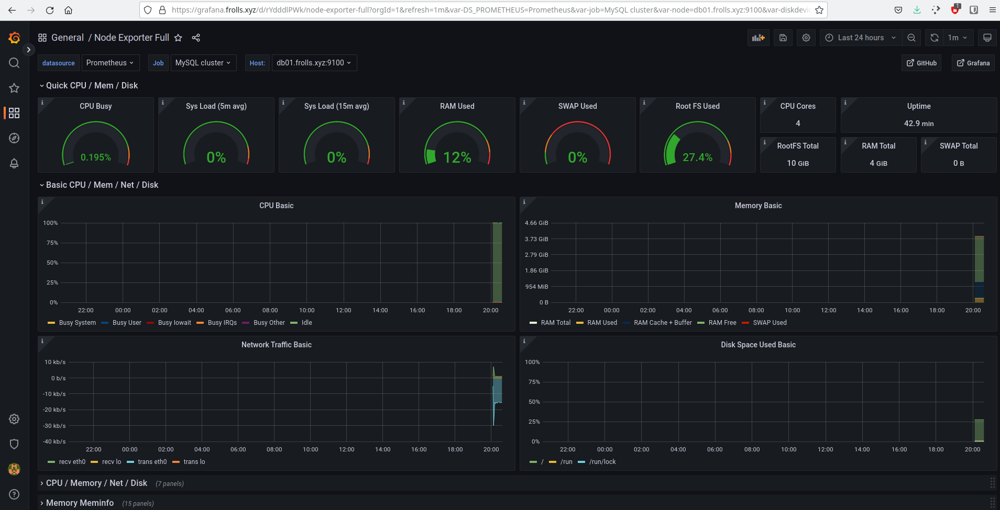
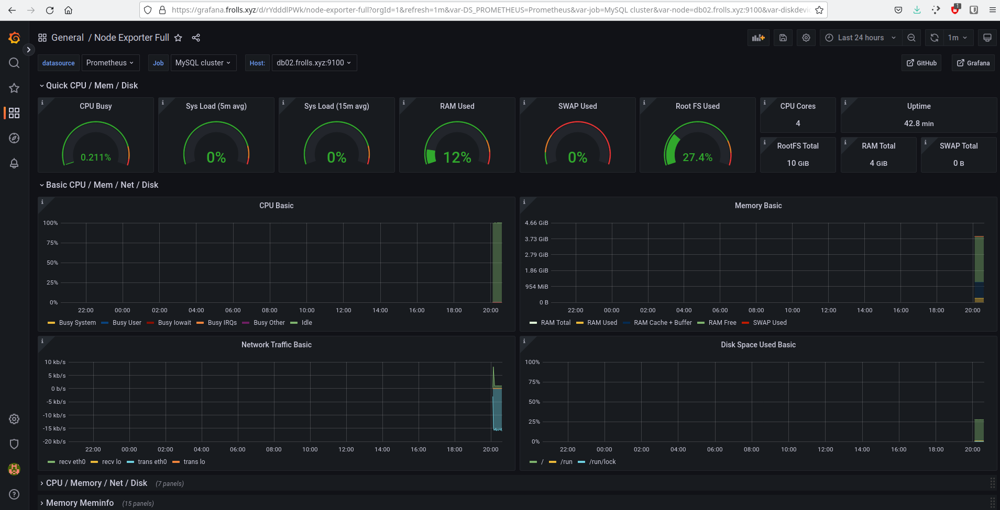
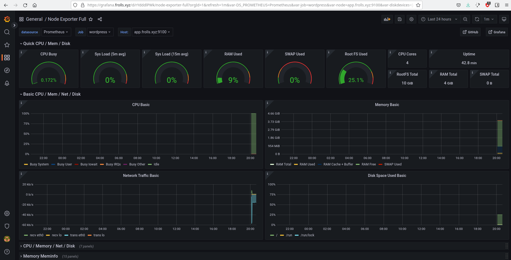
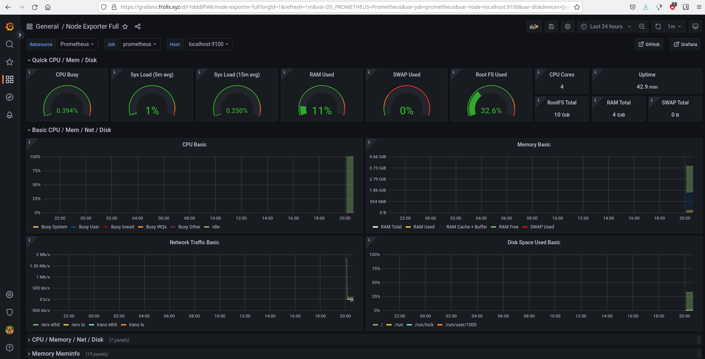
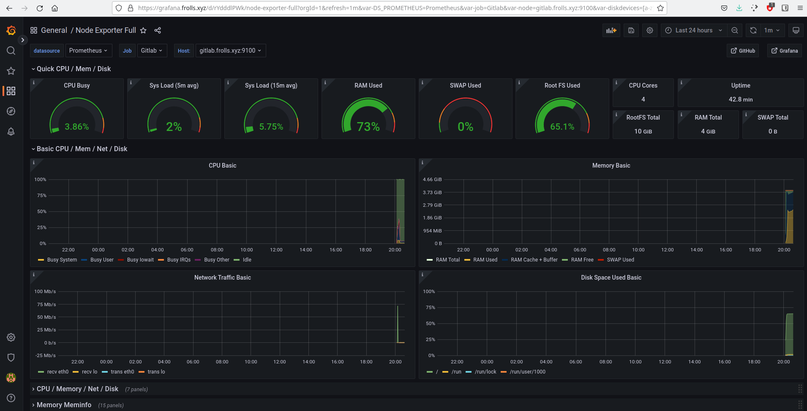
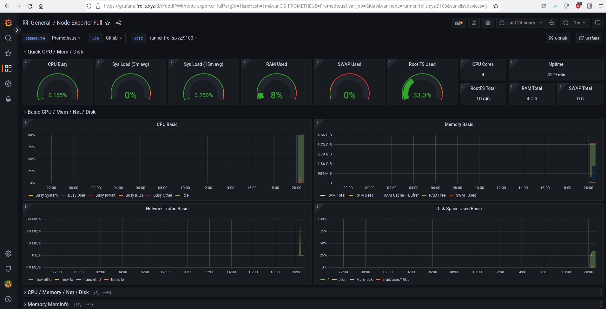

## Установка Prometheus, Alert Manager, Node Exporter и Grafana

Необходимо разработать Ansible роль для установки Prometheus, Alert Manager и Grafana.

Рекомендации:
  - Имя сервера: `monitoring.you.domain`
  - Характеристики: 4vCPU, 4 RAM, Internal address.

Цель:

1. Получение метрик со всей инфраструктуры.

Ожидаемые результаты:

1. Интерфейсы Prometheus, Alert Manager и Grafana доступены по https.
2. В вашей доменной зоне настроены A-записи на внешний адрес reverse proxy:
  - `https://grafana.you.domain` (Grafana)
  - `https://prometheus.you.domain` (Prometheus)
  - `https://alertmanager.you.domain` (Alert Manager)
3. На сервере `you.domain` отредактированы upstreams для выше указанных URL и они смотрят на виртуальную машину на которой установлены Prometheus, Alert Manager и Grafana.
4. На всех серверах установлен Node Exporter и его метрики доступны Prometheus.
5. У Alert Manager есть необходимый [набор правил](https://awesome-prometheus-alerts.grep.to/rules.html) для создания алертов.
6. В Grafana есть дашборд отображающий метрики из Node Exporter по всем серверам.
7. В Grafana есть дашборд отображающий метрики из MySQL (*).
8. В Grafana есть дашборд отображающий метрики из WordPress (*).

*Примечание: дашборды со звёздочкой являются опциональными заданиями повышенной сложности их выполнение желательно, но не обязательно.*

## Решение

Ссылка на [ansible-роль](https://github.com/Frolls/monitoring-role)

1. Интерфейсы Prometheus, Alert Manager и Grafana доступены по https. Давно уже ))
2. Сделано
3. Да, причем, автоматически
4. Готово
5. Сделано

Накопипастил для примера 100500 правил.

Вот скириншоты из prometheus:

6. Да

Скриншоты, показывающие, что так и есть:

Reverse proxy:

MySQL master:

MySQL slave:

Wordpress:

Monitoring:

GitLab:

GitLab Runner:

