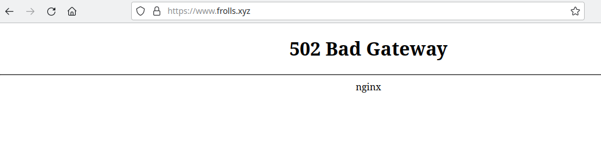
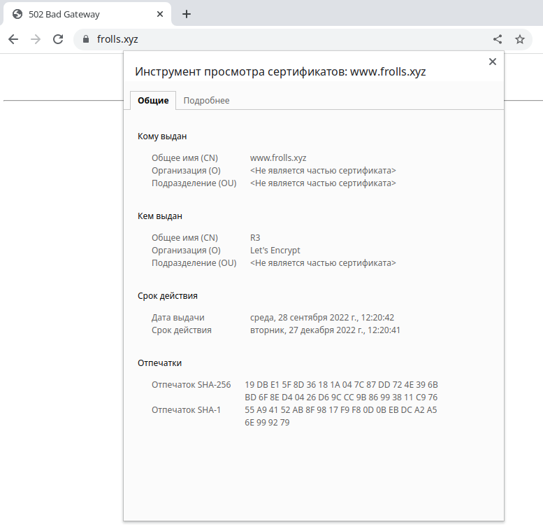

## Установка Nginx и LetsEncrypt

Необходимо разработать Ansible роль для установки Nginx и LetsEncrypt.

**Для получения LetsEncrypt сертификатов во время тестов своего кода пользуйтесь [тестовыми сертификатами](https://letsencrypt.org/docs/staging-environment/), так как количество запросов к боевым серверам LetsEncrypt [лимитировано](https://letsencrypt.org/docs/rate-limits/).**

Рекомендации:
  - Имя сервера: `you.domain`
  - Характеристики: 2vCPU, 2 RAM, External address (Public) и Internal address.

Цель:

1. Создать reverse proxy с поддержкой TLS для обеспечения безопасного доступа к веб-сервисам по HTTPS.

Ожидаемые результаты:

1. В вашей доменной зоне настроены все A-записи на внешний адрес этого сервера:
    - `https://www.you.domain` (WordPress)
    - `https://gitlab.you.domain` (Gitlab)
    - `https://grafana.you.domain` (Grafana)
    - `https://prometheus.you.domain` (Prometheus)
    - `https://alertmanager.you.domain` (Alert Manager)
1. Настроены все upstream для выше указанных URL, куда они сейчас ведут на этом шаге не важно, позже вы их отредактируете и укажите верные значения.
1. В браузере можно открыть любой из этих URL и увидеть ответ сервера (502 Bad Gateway). На текущем этапе выполнение задания это нормально!

## Результаты

1. А-записи были настроены на этапе создания инфраструктуры. При развертывании конфигурации изменения вносятся автоматически
1. Настроены все upstream для выше указанных URL. Да, каждый хост имеет свой конфигурационный файл для nginx
1. В браузере можно открыть любой из этих URL и увидеть ответ сервера (502 Bad Gateway)

Так и есть:

Собственно, [ссылка на роль](https://github.com/Frolls/reverse-proxy-role)