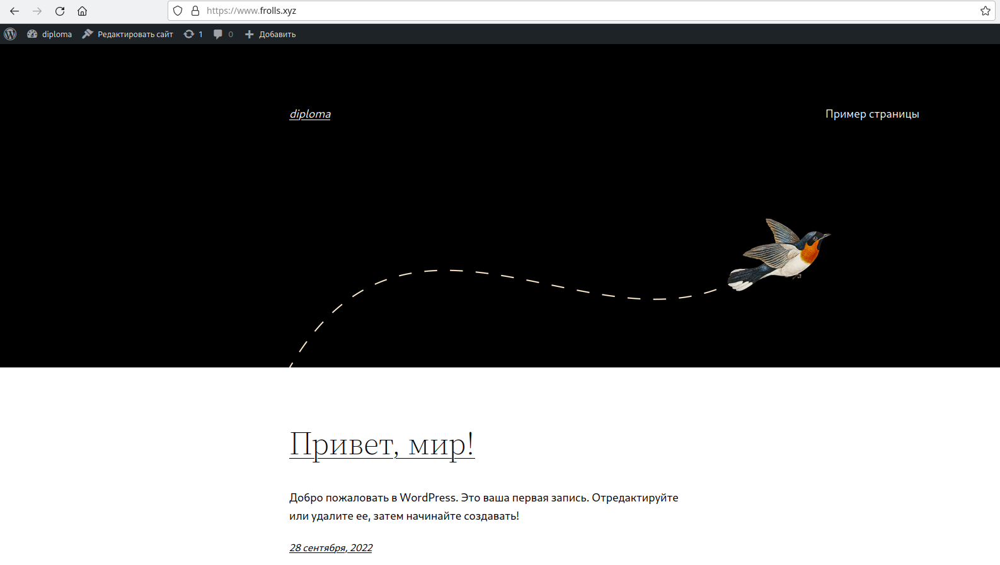
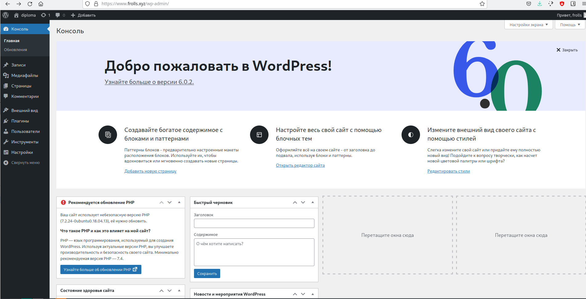
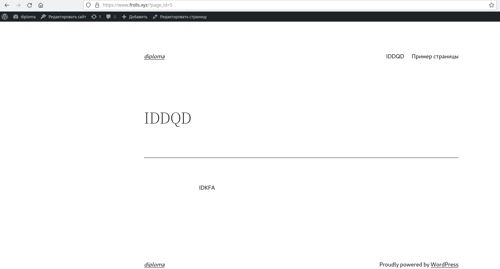

## Установка WordPress

Необходимо разработать Ansible роль для установки WordPress.

Рекомендации:
  - Имя сервера: `app.you.domain`
  - Характеристики: 4vCPU, 4 RAM, Internal address.

Цель:

1. Установить [WordPress](https://wordpress.org/download/). Это система управления содержимым сайта ([CMS](https://ru.wikipedia.org/wiki/Система_управления_содержимым)) с открытым исходным кодом.

По данным W3techs, WordPress используют 64,7% всех веб-сайтов, которые сделаны на CMS. Это 41,1% всех существующих в мире сайтов. Эту платформу для своих блогов используют The New York Times и Forbes. Такую популярность WordPress получил за удобство интерфейса и большие возможности.

Ожидаемые результаты:

1. Виртуальная машина на которой установлен WordPress и Nginx/Apache (на ваше усмотрение).
2. В вашей доменной зоне настроена A-запись на внешний адрес reverse proxy:
    - `https://www.you.domain` (WordPress)
3. На сервере `you.domain` отредактирован upstream для выше указанного URL и он смотрит на виртуальную машину на которой установлен WordPress.
4. В браузере можно открыть URL `https://www.you.domain` и увидеть главную страницу WordPress.

## Результаты

[Ссылка на роль](https://github.com/Frolls/wordpress-role)

1. Установил на nginx
2. Да, работает
3. Работает
4. В браузере можно открыть URL `https://www.frolls.xyz` и увидеть главную страницу WordPress

Не буду показывать процесс установки, отображу стартовую страницу и админку.

Стартовая страница:

Админка:

Создал страничку:

